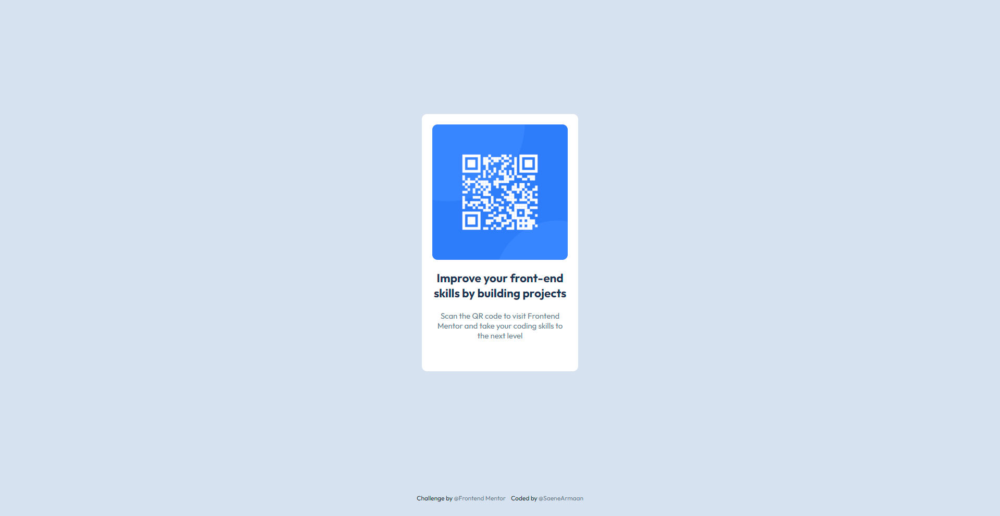

# Frontend Mentor - QR code component solution

This is a solution to the [QR code component challenge on Frontend Mentor](https://www.frontendmentor.io/challenges/qr-code-component-iux_sIO_H). Frontend Mentor challenges help you improve your coding skills by building realistic projects.

## Table of contents

- [Screenshot](#screenshot)
- [Links](#links)
- [Built with](#built-with)
- [Author](#author)

### Screenshot

### Links

- Solution URL: [Solution](https://github.com/SaeneArmaan/qr-code-component-main)
- Live Site URL: [Live URL](https://qr-code-main-component-saene.netlify.app/)

### Built with

- Semantic HTML5 markup
- CSS Grid
- Mobile-first workflow

## Author

- Frontend Mentor - [@SaeneArmaan](https://www.frontendmentor.io/profile/yourusername)
- Twitter - [@Armaan2Saini](https://x.com/Armaan2Saini)
